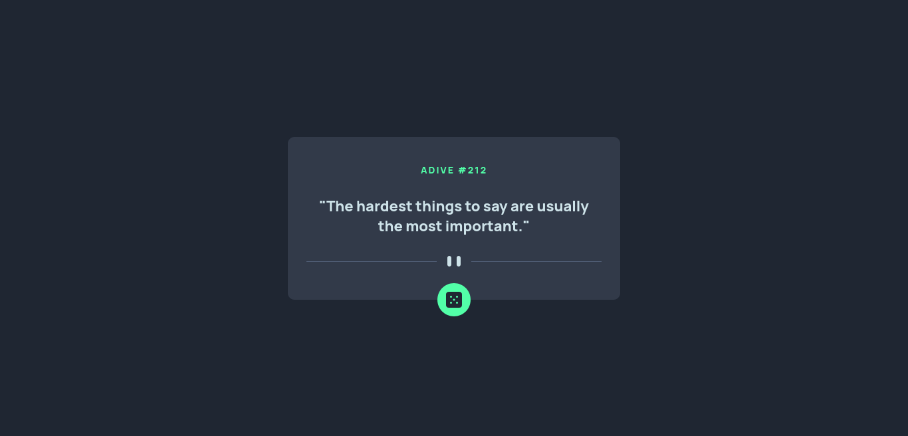
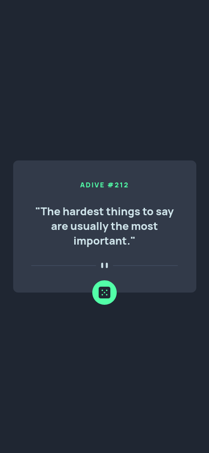

# Frontend Mentor - Advice generator app

This is a solution to the [Advice generator app challenge on Frontend Mentor](https://www.frontendmentor.io/challenges/advice-generator-app-QdUG-13db). Frontend Mentor challenges help you improve your coding skills by building realistic projects.

## Table of contents

- [Overview](#overview)
  - [Links](#links)
  - [Screenshot](#screenshot)
- [My process](#my-process)
  - [Built with](#built-with)

## Overview

### Links

- Live Site URL: (<https://advice-generator-main-fm.netlify.app/>)
- Solution URL: (<https://github.com/suraj-py/Frontend-Mentor-Challenges/tree/master/advice-generator-app-main>)

### Screenshot

- Desktop view

- Mobile view

## My process

### Built with

- CSS custom properties
- Flexbox
- Javascript fetch api
