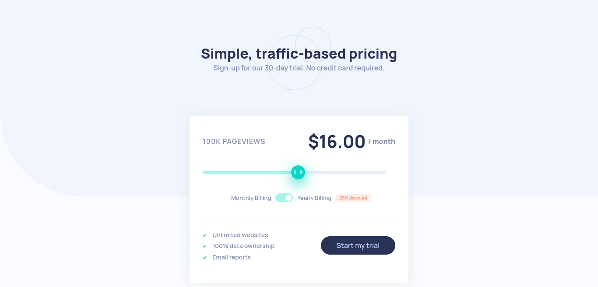

# Frontend Mentor - Interactive pricing component

This is a solution to the [Interactive pricing component challenge on Frontend Mentor](https://www.frontendmentor.io/challenges/interactive-pricing-component-t0m8PIyY8). Frontend Mentor challenges help you improve your coding skills by building realistic projects.

## Table of contents

- [Overview](#overview)
  - [Links](#links)
  - [Screenshot](#screenshot)
- [My process](#my-process)
  - [Built with](#built-with)
  - [What I learned](#what-i-learned)
  - [Useful resources](#resources)

## Overview

### Links

- Live Site URL: (<https://interactive-pricing-comp-fm.netlify.app/>)
- Solution URL: (<https://github.com/suraj-py/Frontend-Mentor-Challenges/tree/master/interactive-pricing-component-main>)

### Screenshot

- Desktop view

- Mobile view

## My process

### Built with

- Flexbox
- Javascript

### What I learned

- How to style a range input. Never knew styling a range input will be that difficult. I have mentioned the blogs that help me alot while buliding this project.

### Useful resources

- [resource1](https://www.smashingmagazine.com/2021/12/create-custom-range-input-consistent-browsers/)
- [resource2](https://nikitahl.com/style-range-input-css#:~:text=CSS%20and%20JavaScript.-,Accent%20color,of%20the%20track%20and%20thumb.)
