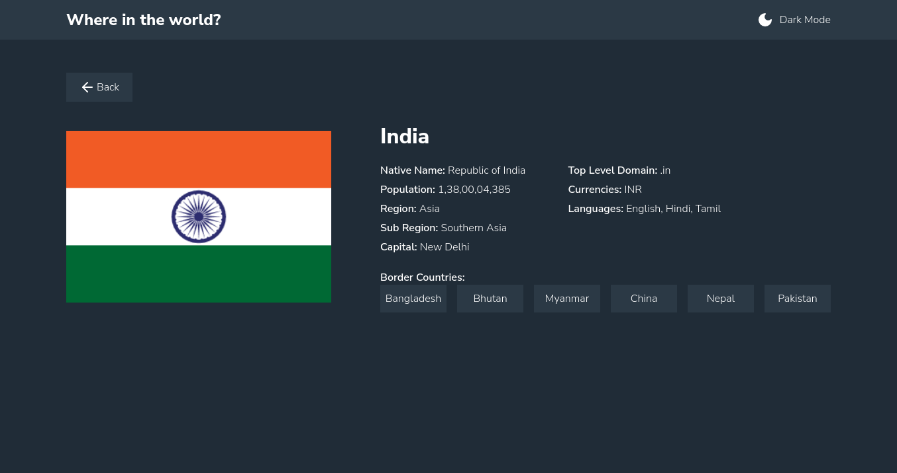

# Frontend Mentor - REST Countries API with color theme switcher solution

This is a solution to the [REST Countries API with color theme switcher challenge on Frontend Mentor](https://www.frontendmentor.io/challenges/rest-countries-api-with-color-theme-switcher-5cacc469fec04111f7b848ca). Frontend Mentor challenges help you improve your coding skills by building realistic projects. 

## Table of contents

- [Overview](#overview)
  - [Links](#links)
  - [Screenshot](#screenshot)
- [My process](#my-process)
  - [Built with](#built-with)
  - [What I learned](#what-i-learned)
  - [Useful resources](#useful-resources)

## Overview

### Links

- Live Site URL: (<https://restcountriessite.netlify.app/>)
- Solution URL: (<https://github.com/suraj-py/Frontend-Mentor-Challenges/tree/master/REST%20Countries>)

### Screenshot

- Dark Mode View

- Light Mode View

- Showing Search Results

- Detail Page View

## My process

### Built with

- Semantic HTML5 markup
- Flexbox
- CSS Grid
- Mobile-first workflow
- [React](https://reactjs.org/) - JS library
- [Styled Components](https://styled-components.com/) - For styles
- [React Routing](https://reactrouter.com/en/main) - Rounting library
- [Lucide Icons](https://lucide.dev/) - For icons

### What I learned

- How to style react components using styled components
- How use React Router

### Useful resources

- [Resource 1](https://www.smashingmagazine.com/2020/04/dark-mode-react-apps-styled-components/) - This helped me to add dark mode using styled component. I really liked this pattern and will use it going forward.
- [Resource 2](https://plainenglish.io/blog/custom-select-component-in-react-and-styled-components-e1f3b0a3a287) - This is an amazing article which helped me finally understand how to make custom select option. I'd recommend it to anyone still learning this concept.

