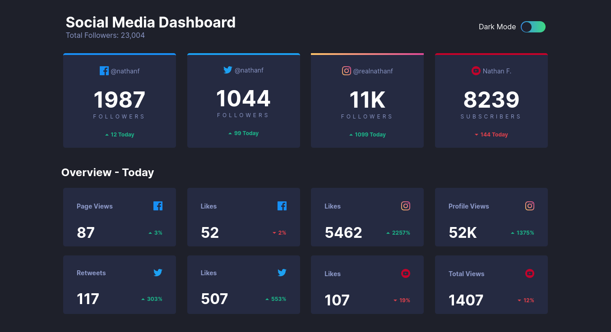
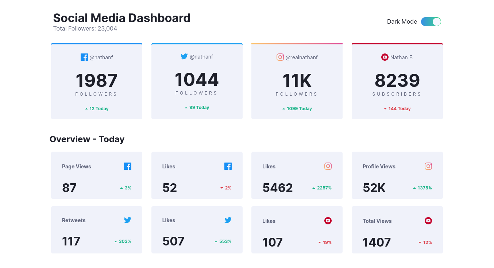
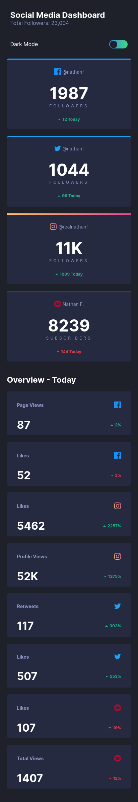
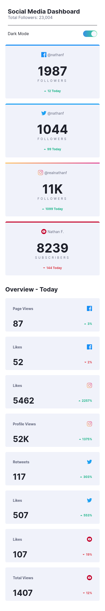

# Frontend Mentor - Loopstudios landing page solution

This is a solution to the [Social media dashboard with theme switcher challenge on Frontend Mentor](https://www.frontendmentor.io/challenges/social-media-dashboard-with-theme-switcher-6oY8ozp_H). Frontend Mentor challenges help you improve your coding skills by building realistic projects.

## Table of contents

- [Overview](#overview)
  - [Links](#links)
  - [Screenshot](#screenshot)
- [My process](#my-process)
  - [Built with](#built-with)
  - [What I learned](#what-i-learned)
  - [Useful resources](#useful-resources)

## Overview

### Links

- Live Site URL: (<https://social-media-dashboard-fm.netlify.app/>)
- Solution URL: (<https://github.com/suraj-py/Frontend-Mentor-Challenges/tree/master/loopstudios-landing-page-main>)

### Screenshot

- Desktop dark mode

- Desktop light mode

- Mobile dark mode

- Mobile light mode


## My process

### Built with

- Semantic HTML5 markup
- CSS custom properties
- Flexbox
- Javascript

### What I learned

This project help me to understand how to add and remove dark mode in a site using CSS variables.

The below code snippets show a css class with all css variables for light mode and a toggle button code to switch between light and dark mode.

```css
/* -- light mode colors  */
.light {
    --bg: hsl(225, 100%, 98%);
    --main_bg: hsl(0, 0%, 100%);
    --card_bg: hsl(227, 47%, 96%);
    --hover_bg: hsl(230, 19%, 88%);
    --heading_text: hsl(230, 17%, 14%);
    --text: hsl(228, 12%, 44%);
}
```

```js
toggle_btn.addEventListener('click', () => {
    ball.classList.toggle('toggle');
    if (ball.classList.contains('toggle')) {
        console.log('true')
        document.body.classList.add('light')
    }
    else {
        console.log('false')
        document.body.classList.remove('light')
    }
})
```

### Useful resources

- [resource 1](https://bootcamp.uxdesign.cc/create-a-dark-mode-for-your-website-d62e73a4275d) - This medium blog helped me for adding dark mode to the site. I really liked the author's step-by-step explaination.
- [resource 2](https://codyhouse.co/nuggets/css-gradient-borders) - Adding linear gradient color to the border of a div is a little tricky part. This article helped me with that.
